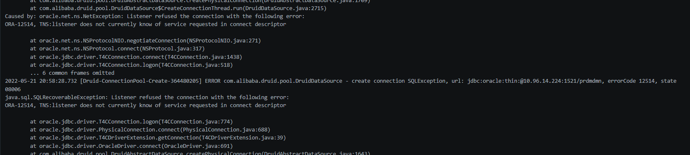
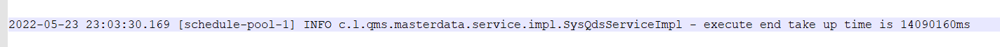

# vC-qds-masterdata
## JAVA实现高性能的数据同步
 最近上线了一个业务系统，生产数据需要全量、增量从第三方数据库同步。这里复判一下处理中遇到的问题，以及解决过程。
 ###系统环境
 业务系统用的是postgres数据库，第三方数据库是oracle，xxJob系统提供任务调度。
 #### 数据同步业务规则
    xxjob任务参数-增量：
    {
    "isAll":"NO", // 同步标识：‘NO’为增量，‘YES’为全量
    "modifyDate":"",// 起始更新时间：格式为'YYYY-MM-DD',isAll=NO时生效，不填默认为当天
    "vendorCode":"" // 业务可选参数
    }
    时间：任务执行时间为凌晨2点
    规则：取当前服务器时间的前一天0点，作为起始更新时间节点，从S4获取起始更新时间节点【SYS_LAST_MODIFIED_DATE】之后的所有数据。
    PS:
    任务执行时间：2022-05-11 02:00:00
    起始更新时间节点：2022-05-10 00:00:00
    获取S4数据时间段：2022-05-10 00:00:00 至 2022-05-11 00:00:00  
    说明：
    1 如果初始化全量同步，设置任务参数。同步标识isAll为"YES" [废弃，xxjob有超时机制],
    2 如果同步最近一段时间内，设置任务参数。同步标识isAll为"NO",起始更新时间节点modifyDate设置为业务要处理的时间节点。
    3 如果只是想同步某一个供应商的数据，给vendorCode赋值即可。
    4 全量同步只在系统初始化时执行。因为会占用资源，影响服务器的运行效率。XXJOB不放开这个权限。所以即使’isAll’设置为’YES’，也是不会生效的。后端服务会在全量初始化数据之后，将全量入口设置关闭
上面的业务规则是成功上线后，调整过的完整规则。但其实一开始并不是这样。
#### 业务处理流程不清晰 测试库单表100W数据，生产库单表1000W
    我们项目是5月21号上线的，但直到5月20号，S4生产数据库才完成数据初始化，在这之前我是不知道生产到底有多少数据。
    PS：这里有个前提是：我们在开发完上到测试环境后，也提醒业务去问过S4生产数据量有多少，没有得到S4的反馈。[这之间存在沟通问题]
    21号上线20号开发的同学才知道，需要同步的数据量是多少。这是一件很恐怖的事情。
    做过这方面数据同步的同学，懂的都懂。测试和生产完全不是一个概念。在外部系统环境一致的情况下，单表100W数据量
    和单表1000W数据量，处理方式完全天壤之别。
    好了，吐槽完了。该上货了，下面是我遇到的坑。
##### 一号坑位：XXJOB
    测试环境可以ALL单表100W数据，XXJOB跑几分钟成功没问题，一放到生产，跑完100W数据，已经过去了半个小时。此时我内心的OS
    “可以接受，毕竟生产的oracle数据量大嘛”
    “好嘛，我再等等看”，
    一个半小时后，masterdata服务卡主了。
    “芭比Q了，怎么办”，
    “看日志呗”,
    “日志，我没权限呐？”。
    找人开了xcloud【内部用的paas：平台服务】的权限，看了日志，发现masterdata服务被重启了。
    “XXXXX...”
    看来这个xxjob不适合做生产库的全量同步。
    “今天可是要上线的呐，加紧修改代码中....”
###### PS: 这个问题我想了很久，后面觉得即使一开始就知道生产数据量，有些问题也很难去规避。但是可以作为一种经验，以后遇到会处理的更得心应手些。

##### 二号坑位：S4
    接上面的，已经是上线当天的下午了，[因为我们是周六上线，周五其实正式环境都已经准备好了]
    终于把代码逻辑改好了，放测试环境试一下。
    "嗯，项目启动执行，加个开关，再加上异步处理。多打印几行日志...完美"
    项目终于不用被XXJOB自动重启了。
    “数据跑起来，一个小时200W，差不多五个小时就能全部跑完，也行吧。反正只需要初始化全量一次。”
    “一个小时、两个小时、三个小时、四个小时...嗯，看着数据库里面count出来的900W数据，内心很是满足，问题不大。”
    很开心的下了班，吃完饭，到家已经9点多了。不放心的打开了VPN。看了日志。"error 12514..."，S4的oracle咋断开了。
    赶紧上报了问题，再回我消息已经是5月22号了。
    
    22号，DBA回复了我们，他们在21号当天晚上做了访问白名单。而我们生产的服务器并没有申请在白名单之内。
    这个时候业务其实也慌了，来不及去抱怨。赶紧联系人处理这个事情....
    到晚上11点47的时候，发来了友好的弹框。“白名单已经加上了，你试一下”，一连发了好几条消息。虽然我很困，但是我知道，如果不回消息，她不久就会Call过来。
    “好的，我试一下”
    登陆到VPN，点了一个测试的任务，试了一下，确实可以了。
    “业务：你们之前跑了900W数据了，剩下的数据跑完应该很快吧....”
    其实，我在她去联系人处理白名单这个时间，已经做了处理方案：
            QDS,查询最近一次同步的数据，得到最后从S4同步的数据行【material_no = '*****', logic_plant_code = '*****'】
            select * from sys_md_material_logicalplant  order by create_time desc limit 1
            /**S4，找到数据行【material_no = '*****', logic_plant_code = '*****'】的行号NO=9299978**/
            select *
            from (select t.*, rownum as no
            from (
            SELECT
            ECC_MARC.MATNR as materialNo,
            ECC_MARC.WERKS as logicPlantCode,
            ECC_MARC.SERNP as serialNoProfile,
            ECC_MARC.STAWN as htsCode,
            ECC_MARC.BESKZ as procurementType
            FROM prdpcdw.ECC_MARC  ORDER BY prdpcdw.ECC_MARC.SYS_LAST_MODIFIED_DATE desc
            ) t)
            where no between 1 and 10000000 and materialNo = 'SBB1B56203' and logicPlantCode = 'L210';
            /**S4,需要增量同步的数据【不能通过日期时间段，因为S4那边的数据全量就是在【5/20/2022】开始的，而我们如果要增量也只能按天。而按天只能取到S4的全量数据。我们增量的方案只能是：取序号9200000之后的所有数据。】**/
            select *
            from (select t.*, rownum as no
            from (
            SELECT
            ECC_MARC.MATNR as materialNo,
            ECC_MARC.WERKS as logicPlantCode,
            ECC_MARC.SERNP as serialNoProfile,
            ECC_MARC.STAWN as htsCode,
            ECC_MARC.BESKZ as procurementType,
            ECC_MARC.SYS_LAST_MODIFIED_DATE
            FROM prdpcdw.ECC_MARC  ORDER BY prdpcdw.ECC_MARC.SYS_LAST_MODIFIED_DATE desc   
            ) t)
            where no between 9200000 and 10000000;
    但方案是要确认的，所以第二天才可以处理
###### PS: S4的问题，其实我觉得暴露出很多企业，尤其IT公司的流程漏洞和不规范。但是这个漏洞和不规范更重要的是要靠问题处理人自觉去跟进和通知相关人员。
##### 三号坑位：DBA
    时间已经来到了23号，周一。虽然说项目已经上线了。但其实还并没有用户真正在使用。[其他原因...]，早上先通过了方案。得到了可以白天处理的回复。
    “再三确认了代码逻辑，没啥问题。开启服务...”，
    剩下的数据跑完去了一张临时表，接下来就是紧张刺激的数据合并了。在紧张慌乱中，我把跑完那900W数据的表drop掉了。【其实DBA是可以恢复数据的，但流程很麻烦。别人也不一定会帮你做】
    楞了几分钟。想了一会。
    "这个生产的数据库每个人都这么大权限，DBA就没有做限制的嘛"
    "....哈哈哈"
###### PS: DB的权限问题，很重要。上线之前一定要处理的，显然。这也是个漏洞
##### 四号坑位：自己
    “内耗是没有用的，晚上再跑一次呗”
    在晚上11点的时候，数据终于全量同步完了。
    
###### PS: 做事还是不够认真，考虑问题不够全面。做技术的，菜才是原罪。
    

    
 